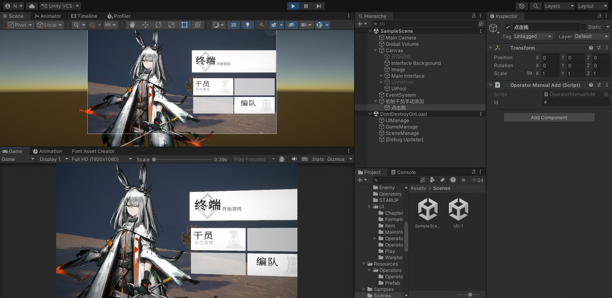

# 昨日圆车demo (类明日方舟2D塔防)

使用Unity + C# 从零开发的塔防游戏。

<a>https://www.bilibili.com/video/BV1jvE266EC9/?spm_id_from=333.1007.top_right_bar_window_history.content.click&vd_source=3a0ec816dc84ed6f4e6fbfa57169f63d<\a>

## 核心功能

- **网格地图 **:基于二维数组的地图系统，支持地形类型、可行走判定、高度层级
- A*寻路:手写实现，自定义移动代价，敌人可根据移动类型选择对于自身来说的最优路径。

- 干员拖拽部署：射线检测网格+网格吸附，拖拽干员自动对齐到鼠标下方的可部署网格，松开后开始部署。

- 有限状态机驱动战斗：干员和敌人的全部行为，通过FSM状态切换驱动
- 索敌和阻挡系统：敌方自动寻找攻击范围内，部署在可到达网格的干员并沿路径移动，遇到干员自动进入攻击/被阻挡状态。
- 干员升级系统：升级经验曲线+属性成长，支持升级预览。多名干员共享同一个面板UI，通过获取相应干员信息显示相应内容。
- 编队系统：干员信息传入编队，战斗关卡读取编队配置。
- JSON 本地化存储：干员/编队数据通过 JsonUtility 持久化到本地文件。

## 技术栈

Unity | C# | A*寻路 | FSM状态机 | Spine | ScriptableObject | DOTWeen | JsonUtility

## 架构设计

各模块遵循"最小变更"原则：新增功能只需扩展，无需修改已有逻辑。

- 状态机驱动：所有实体行为通过FSM状态切换实现，新增单位类型只需扩展对应状态类。

- 事件解耦：管理器之间通过 Event 通信（部署数变化->UI自动刷新，不直接互相调用)，避免模块间硬引用。

- 继承体系，“CombatEntity -> Entity -> Operator/Enemy”，基类收敛公共逻辑，子类只关注差异化行为。

- 数据驱动：干员属性、敌人配置、地形数据全部通过 ScriptableObject 配置，数值调整无需修改代码。

  ## 项目结构

  Assets/Script/
  ├── Entity/          # 实体基类
  ├── Operator/        # 干员（部署、攻击、职业）
  ├── Enemy/           # 敌人（寻路、索敌、逃逸）
  ├── StateMachine/    # 通用状态机
  ├── Manage/          # 游戏管理器
  ├── Level/           # 升级系统
  ├── Data/            # SO 配置 + JSON 存档
  ├── UI/              # 界面
  └── A_Star.cs        # A* 寻路
